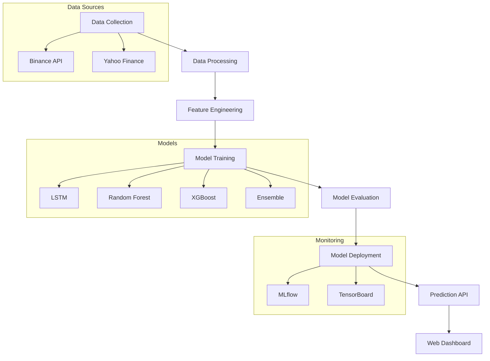

# Application Flowchart

## Flow Description
1. **Data Collection**: Gather financial data from Binance API and Yahoo Finance
2. **Data Processing**: Clean and preprocess raw data
3. **Feature Engineering**: Create meaningful features for model training
4. **Model Training**: Train multiple machine learning models
5. **Model Evaluation**: Evaluate model performance using various metrics
6. **Model Deployment**: Deploy best performing model to production
7. **Prediction API**: Expose model predictions through REST API
8. **Web Dashboard**: Visualize predictions and trends in web interface
